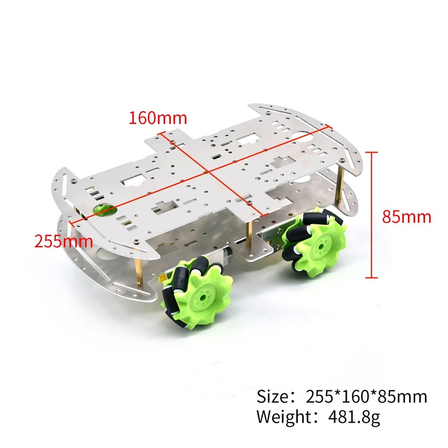
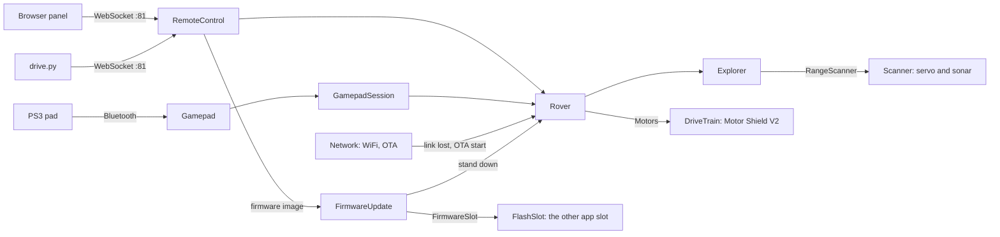

# rover

A four-wheel mecanum rover on an ESP32. Switched on, it explores a room by
itself, sweeping an ultrasonic sensor across the way ahead and turning toward
open space. Take over at any time from a browser, a terminal or a PS3
controller, and hand control back with one button.



- **Autonomous exploration.** It measures five bearings, cruises while the
  path is clear, turns toward the more open side when it is not, and halts
  if it finds itself boxed in or its sensor hears nothing for three sweeps in
  a row.
- **Browser panel.** Two joysticks (one translates, one pivots), a speed
  slider and a live fan of the five distances, in a page you open straight from disk; and block programs, which
  a simulator previews before they drive the rover. Six looks (three themes,
  each dark and light) under the gear, and firmware updates from there too.
- **Keyboard client.** Drive and watch telemetry from a terminal.
- **PS3 controller** over Bluetooth, optional.
- **Fails safe.** Every command expires within 1.5 s, losing the driver or
  the WiFi stops the wheels, and the board can be reflashed over WiFi.

It is a Wemos D1 R32 (ESP32) with an Adafruit Motor Shield V2, four TT gear
motors on 60 mm mecanum wheels, a two-deck aluminium chassis and a 3S 18650
pack. [docs/BOM.md](docs/BOM.md) has the full list.

## Quick start

You need [PlatformIO](https://platformio.org/); the commands below use its
default install path, `~/.platformio/penv/bin/pio`.

1. **WiFi settings.** `cp src/config.example.h src/config.h` and fill in your
   network. `src/config.h` is gitignored; keep it that way. By default the
   rover takes the static address 192.168.0.115 (set in `src/Network.cpp`,
   and as `upload_port` for `car_ota` in `platformio.ini`). Set
   `WIFI_IS_STATIC_IP` to `false` to use DHCP; the rover also answers as
   `rover.local`.
2. **Build.**
   ```
   ~/.platformio/penv/bin/pio run -e car_wire
   ```
3. **Flash over USB the first time**, with the rover on a stand (it starts
   exploring as soon as it boots), and watch it join the network:
   ```
   ~/.platformio/penv/bin/pio run -e car_wire -t upload
   ~/.platformio/penv/bin/pio device monitor -e car_wire
   ```
4. **After that, flash over WiFi:**
   ```
   ~/.platformio/penv/bin/pio run -e car_ota -t upload
   ```
   `car_ota` uploads to 192.168.0.115, without the gamepad. With DHCP, change
   its `upload_port` in `platformio.ini` (`rover.local` works). With the PS3
   pad, set `ROVER_ENABLE_GAMEPAD` to 1 in `src/Features.h` first, which turns
   it on for every environment, or the update removes the pad. With an OTA
   password, see `src/config.example.h`. Or update from the panel: the
   gear's Options, Firmware, takes the `firmware.bin` a build leaves in
   `.pio/build/<env>/` (see below).
5. **Drive it.** Open `extras/joystick/joystick.html` in a browser straight
   from disk (the rover cannot serve it), enter the rover's address and press
   Connect. The header's Normal | Advanced toggle is the rover's control
   scheme (below), or on the simulator the simulator's own. The Drive tab
   has the two joysticks, the left one to translate and the right one to
   pivot; the Program tab has block programs. The header's Rover | Simulator switch puts both tabs on a
   simulated rover instead, to try the controls or preview a program with no
   rover connected: then they drive only the simulated rover, and Stop stops
   both. The gear picks the page's look. The Program tab loads its block
   editor from cdn.jsdelivr.net, so it needs the internet the first time (the
   browser may keep a copy); driving never does. Or, from a terminal:
   ```
   pip install websockets
   python3 client/drive.py                   # or --host rover.local
   python3 client/drive.py --listen          # watch without driving
   ```

For the PS3 controller, build `car_wire_gamepad` instead and set the pad's
paired address in `src/Features.h`.

## Controls

Any command, a stop included, takes control from exploration; the Autonomous
button, `t` or START hands it back, and also restarts exploration that has
halted. While you hold a control the client re-sends it; let go and the rover
stops within half a second.

| | Browser panel | Keyboard (`drive.py`, and the panel) | PS3 pad |
|---|---|---|---|
| Move | Left joystick, eight directions | `w` `s` forward and back, `a` `d` strafe | Left stick, eight directions |
| Pivot (Advanced only) | Right joystick: pick Pivot or Pivot sideways over it, and its quadrant picks the pivot; under Normal it is shown, off | -- | Hold L1 (pivot) or R1 (pivot sideways) and push the left stick |
| Rotate | Hold the Left or Right button | `q` `e` | L2 left (ccw), R2 right (cw) |
| Speed | Slider, 0-255 (scaled by stick deflection) | `-` `+`, starting at 64 | Stick deflection, up to 50; trigger pull, up to 25 |
| Control scheme | Normal \| Advanced, in the header | -- | SELECT; the player LEDs show it (1 Normal, 2 Advanced) |
| Programs | The Program tab | -- | -- |
| Simulator | Rover \| Simulator, in the header: the Drive tab and programs drive a simulated rover | -- | -- |
| Stop | Stop | space | Cross (a held stick then drives again only from centre), or let go of the stick |
| Back to autonomous | Autonomous | `t` | START |

The panel takes `drive.py`'s keys too: the drive and speed keys while its
Drive tab shows, Space and `t` on either tab. The gear's Options list them.
Holding two drive keys drives the one pressed last; the left joystick has
the diagonals.

After a power-on the rover explores. After any other reset (an OTA flash, a
crash, the watchdog) it starts in manual and waits, and it drops to manual
if it loses WiFi or an OTA flash starts.

## Updating from the panel

The gear's Options has a Firmware section. Connect to the rover, press
Choose file and pick a build's `firmware.bin` from `.pio/build/<env>/` (pick
the environment the rover should run: `car_wire_gamepad` keeps the pad),
type the OTA password if the rover has one, and press Update. The rover
stops, takes the file over the panel's own link, checks it and restarts into
it in manual; connect again and Options says whether it runs the file sent.
It needs firmware that already supports this, so the first time is a USB or
`car_ota` flash.

Driving it in any way, Autonomous included, ends the update (Stop does
not), and so do Cancel, closing the page or losing the link. However it
ends, the rover keeps the firmware it had. A new build is on trial until it
has run half a minute on WiFi: a reset before then, or a build that crashes
or never gets back on WiFi, goes back to the firmware it had, so leave the
rover on for that long after an update. Keep the rover still or on a stand
while you update it.

The rover holds one **control scheme** for every controller. Normal drives
the eight translations and the two rotations. Advanced adds the eight pivots,
which nobody has checked on the bench yet ([docs/mecanum.md](docs/mecanum.md)).
Changing the scheme stops a pivot under way (a held pivot stick, on the
panel; the held stick, on the pad), which then needs a fresh push.

## Programs and the simulator

The panel's Program tab builds programs from blocks: drive a move for a time
or until a condition, read the sonar, wait, loop, branch. Its File menu loads
an example (Square, Strafe box, Patrol, Mecanum tour), exports a program to a
file and imports it again, and clears the editor. Loading over a program or
clearing one asks first, and Ctrl+Z (Cmd+Z on a Mac) in the editor brings a
cleared one back. **Preview**
runs it on a simulated rover in a simulated room and sends nothing to the
real one; **Run on rover** drives the rover with it,
re-sending each move as a held control does. A press of any drive control,
Stop, Autonomous, Stop program, losing the link or the page losing focus
stops a program on the rover, and it never takes the rover back. Before
driving a pivot on a rover that is not on Advanced, Run asks first.

The simulator is a preview, not a promise: wheels that never slip, no inertia
or motor lag, one sonar ray per ping, a chassis that stops dead on contact,
and no exploring. Its readings are as old as the rover's, so a program that
works in the preview does not rely on fresher ones. The numbers that describe
this rover are estimates, at the top of
[`extras/joystick/js/sim.js`](extras/joystick/js/sim.js), each with how to
measure it on the bench: full wheel speed (`SIM_WHEEL_MAX_MPS`), the duty
below which the wheels do not turn (`SIM_DEADBAND_PWM`), how hard a released
wheel drags (`SIM_RELEASED_DRAG`), the chassis and where its wheels sit
(`SIM_CHASSIS`, `SIM_WHEEL`), and the sonar's reach and the angle past which a
surface sends no echo (`SIM_SONAR`).

## How it works



`Rover` decides who is in control, drives the wheels through the one path
that clamps every input, and releases them when each command's deadline
passes. `Explorer` is the autonomy, a state machine that sweeps, cruises,
turns, backs off, sidesteps or halts. `GamepadSession` holds the pad's rules,
and `FirmwareUpdate` a firmware update's over the link. They are plain C++
that reach the hardware only through small interfaces, so they are tested on
your computer rather than on the robot. The adapters around them
(`DriveTrain`, `Scanner`, `Network`, `RemoteControl`, `FlashSlot`, `Gamepad`)
only translate. The
WebSocket format is in `src/Protocol.h`, and [AGENTS.md](AGENTS.md) explains
the design and the rules it keeps.

## Testing

```
~/.platformio/penv/bin/pio test -e native     # unit tests on the host, no board needed
python3 tools/check_protocol.py               # the clients agree with the firmware
node --test extras/joystick/test/             # the browser panel and its simulator, in Node
```

CI runs all three, parses the Python scripts in `client/` and every panel
script, and builds every board environment on each pull request and each
push to `main`. What no test can know (which motor is on which terminal,
which way the servo turns) is covered by
[docs/bench-checklist.md](docs/bench-checklist.md).

## Safety

- **Bench-test first.** None of the wiring has been verified. Work through
  the bench checklist with the wheels off the ground before the rover drives
  on the floor, and keep it on a stand whenever you flash it.
- **It moves on power-up.** Switching it on starts exploration straight away,
  and so does a USB flash, which resets the board the same way. An OTA flash,
  from PlatformIO or the panel, or a crash comes back in manual.
- **Motor voltage.** PWM duty is a fraction of the pack voltage, and
  `MOTOR_SPEED_LIMIT` in `src/Tuning.h` is still 255, so at full speed a full
  3S pack drives the 3-6 V TT motors at about twice their rating. Cap it
  (about 120) or give the motors a 6 V supply; see the bench checklist and
  the roadmap.
- **A reset does not stop the wheels by itself.** The shield keeps driving
  them through an ESP32 reset until the rebooted firmware releases them,
  about half a second, and for as long as the board fails to boot. Keep a
  way to cut the motor power within reach.
- **Programs drive the real rover.** Preview a program first, keep Stop in
  reach while it runs, and remember that the pivots are not bench-verified.
- **Boot hazard.** The scanner's echo wire sits on GPIO12, a strapping pin
  that can stop the board booting. The fix is a wire; see the bench
  checklist.
- **No authentication.** Anyone on your WiFi can drive the rover, and can
  flash it, from PlatformIO or the panel, unless you set an OTA password in
  `src/config.h` (`src/config.example.h` shows how). Keep it on a network
  you trust.

## Documentation

- [docs/bench-checklist.md](docs/bench-checklist.md): verifying the wiring, safely
- [docs/mecanum.md](docs/mecanum.md): which way each wheel turns for every move
- [docs/ROADMAP.md](docs/ROADMAP.md): what would make it drive and navigate better
- [docs/BOM.md](docs/BOM.md): parts list
- [docs/Readme.md](docs/Readme.md): motor shield terminals, board pinout, chassis
- [docs/pinouts.md](docs/pinouts.md) and [docs/extra.md](docs/extra.md): reference pinouts and an older wiring
- [AGENTS.md](AGENTS.md): architecture, invariants and conventions, for contributors and coding agents
- [docs/project/handoff.md](docs/project/handoff.md): where the work stands and what to work on now
- [docs/features.md](docs/features.md): the owner's requested panel features, itemised
- [docs/project/setup.md](docs/project/setup.md): creating the repo's Claude Project (its goal, instructions and environment files)
