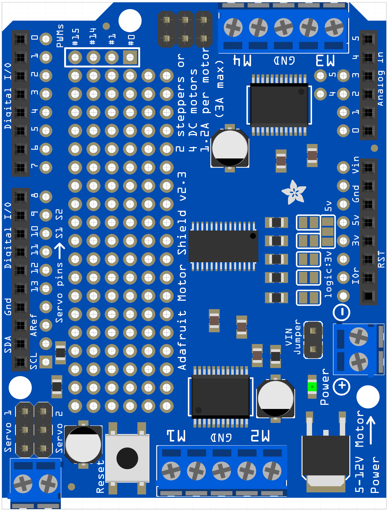
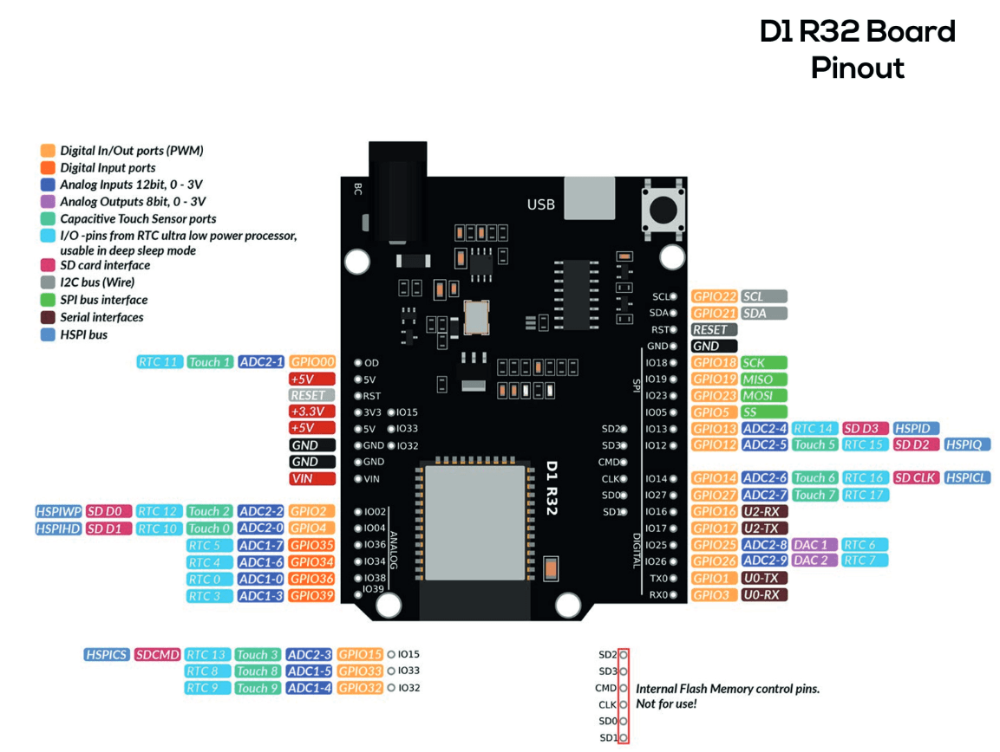
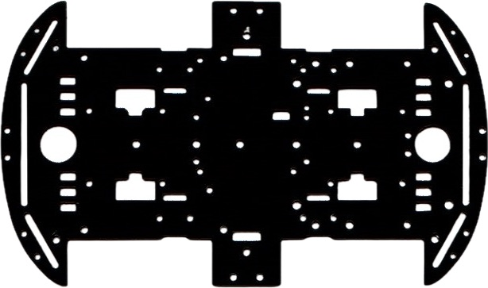

## Adafruit MotorShield V2.0 pinout

| Mecanum Wheel | Tmnl |
| :------------ | ---- |
| Rear Left     | M2   |
| Rear Right    | M1   |
| Front Left    | M4   |
| Front Right   | M3   |

## R1 D32 pinout

<!-- ### Level Shifter Pinout -->
<!-- *   -->

## Chassis actual

### B/W

