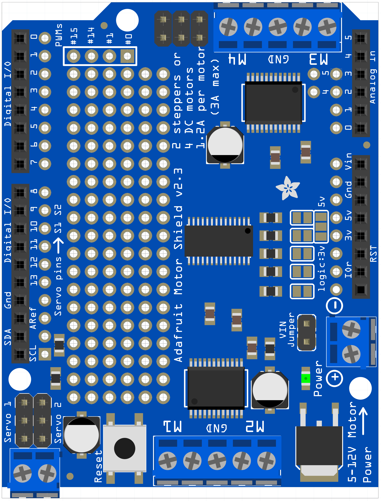

## Motor Connections

### Image

### Adafruit MotorShield V2.0
| Mecanum Wheel | Tmnl |
| :------------ | ---- |
| Rear Left     | M2   |
| Rear Right    | M1   |
| Front Left    | M4   |
| Front Right   | M3   |

Found PS3 Controller
ESP32 mac address: 94:b9:7e:c7:af:12

## Microcontroller Pin Connections

### Level Shifter Pinout
*  

### Esp32 Pinout

### Esp32 <-> Arduino

| ESP32     | Arduino  |
| --------- | :------- |
| GND       | GND      |
| RX (IO16) | TX (10   |         
| TX (IO17) | RX (11)) |         
| 5V        | 5V       |    

<!-- ### Esp32 C3 Super Mini <-> Arduino
| ESP32       | LvlBoard | Arduino    |
| ----------- | :------- | :--------- |
| 3.3V        | LV       |            |
| GND         | GND      | GND        |
| GPIO20 (RX) | LV1      |            |
| GPIO21 (TX) | LV2      |            |
| 5V          | HV       | 5V         |
|             | HV1      | TX (Pin 1) |
|             | HV2      | RX (Pin 0) | -->