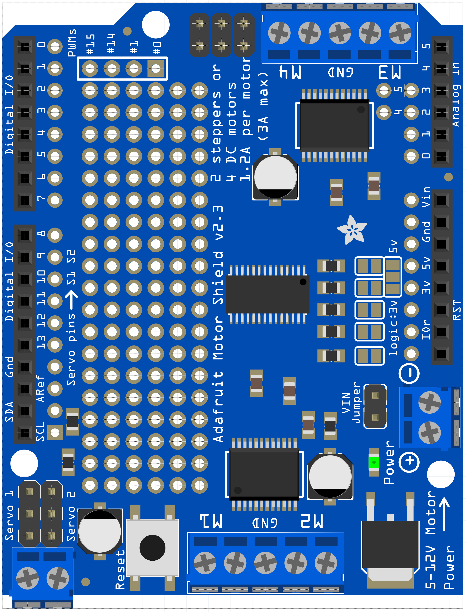
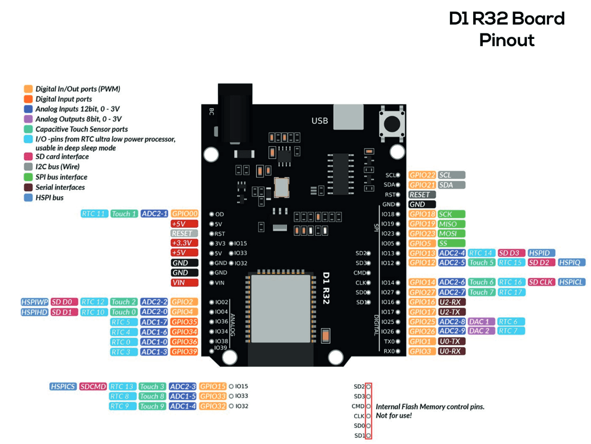
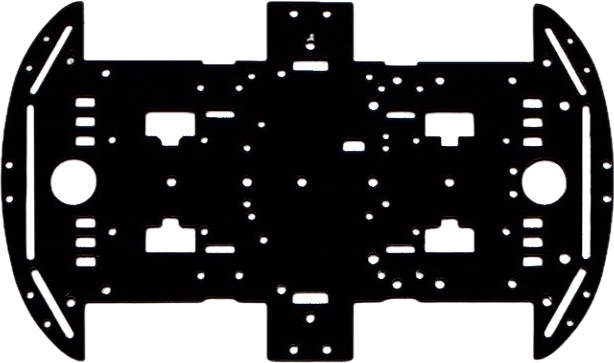

## Adafruit MotorShield V2.0 pinout

| Mecanum Wheel | Terminal |
| :------------ | -------- |
| Rear Left     | M2       |
| Rear Right    | M1       |
| Front Left    | M4       |
| Front Right   | M3       |

**The firmware disagrees with this table.** It drives front-left from M2,
front-right from M1, rear-right from M4 and rear-left from M3
(`pins::MOTOR_TERMINAL = {2, 1, 4, 3}` in [src/Pins.h](../src/Pins.h), in the
order front-left, front-right, rear-right, rear-left). At most one of the two
matches the wiring. [bench-checklist.md](bench-checklist.md) says how to find
out which, and whichever is wrong should then be corrected so they agree.

## D1 R32 pinout

Pin numbers in the firmware are ESP32 GPIOs, not the UNO-style labels printed
on the board; the two differ (D8 is GPIO12). Every assignment is in
[src/Pins.h](../src/Pins.h).

## Level shifting

The HC-SR04 drives its ECHO line to 5 V and the ESP32 is not 5 V tolerant, so
each ECHO line needs a resistor divider or a level shifter channel, with the
sensor on the 5 V (HV) side and the ESP32 pin on the 3.3 V (LV) side. Whether
the rover has either is not yet recorded; section 4 of
[bench-checklist.md](bench-checklist.md) covers it.

## Chassis actual

### B/W

