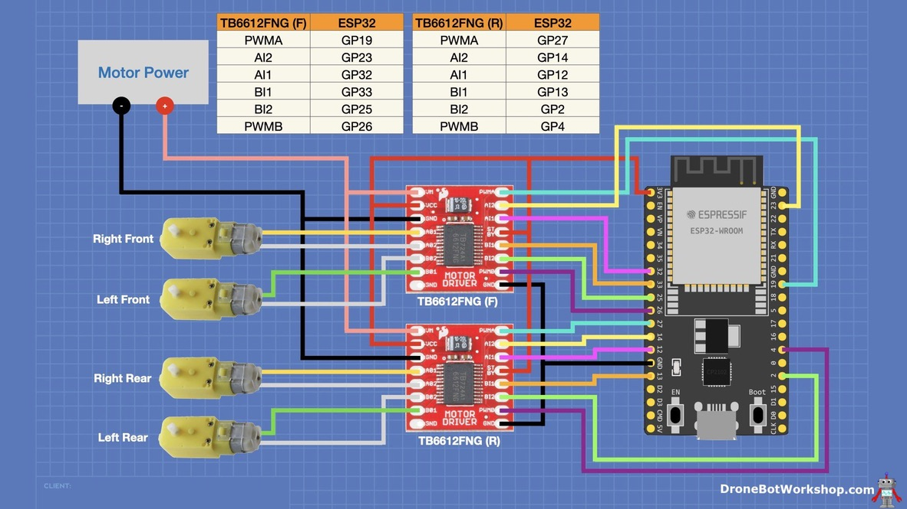

### TB6612FNG <-> ESP32 Pin mapping
| ESP32 | TB6612FNG (F) | TB6612FNG (R) |
| :---: | :-----------: | :-----------: |
| GP19  |     PWMA      |               |
| GP23  |      AI2      |               |
| GP32  |      AI1      |               |
| GP33  |      BI1      |               |
| GP25  |      BI2      |               |
| GP26  |     PWMB      |               |
| GP27  |               |     PWMA      |
| GP14  |               |      AI2      |
| GP12  |               |      AI1      |
| GP13  |               |      BI1      |
|  GP2  |               |      BI2      |
|  GP4  |               |     PWMB      |

### Wiring Diagram (using TB6612FNG with ESP32)
